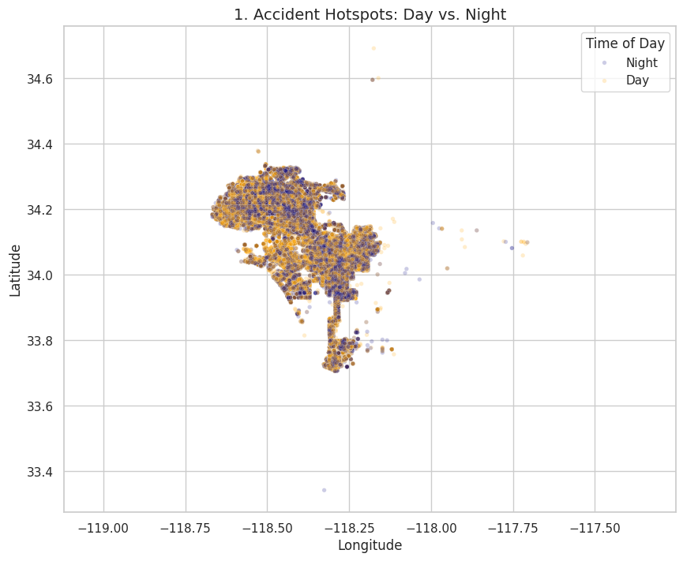
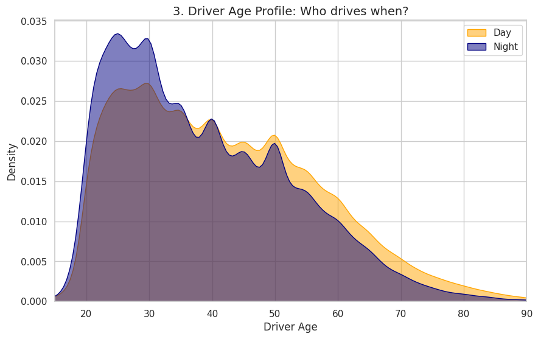
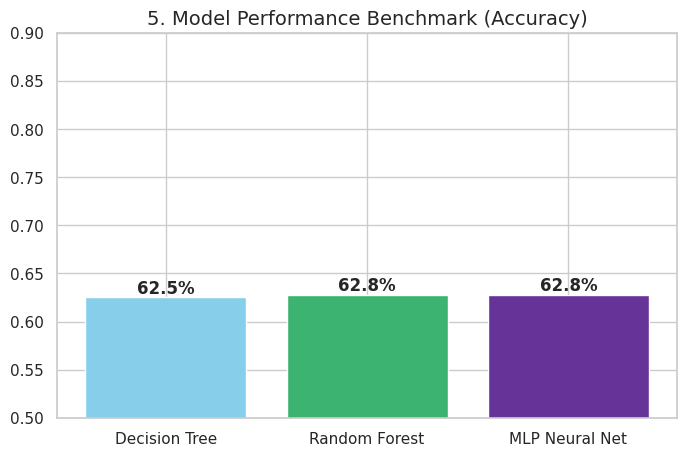

# 🚗 Predictive Analysis of Traffic Collision Risks in Los Angeles

## 📋 About the Project

This project provides an end-to-end Data Science analysis of traffic safety in Los Angeles. Using the **full historical dataset** provided by the City of Los Angeles, the goal was to identify driver behavioral patterns and build a machine learning model capable of predicting the **time of a collision (Day vs. Night)** based on demographic and geographic features.

**Key Objectives:**
* Analyzing spatial and temporal patterns of traffic accidents.
* Investigating the correlation between driver demographics (Age/Sex) and risk exposure.
* Benchmarking ML algorithms on large-scale data to predict accident timing.

## 🛠 Tech Stack

* **Language:** Python 3.13
* **Data Processing:** Pandas (Optimized for large datasets), NumPy
* **Machine Learning:** Scikit-Learn
    * *Models:* Random Forest, Decision Tree, Multi-Layer Perceptron (Neural Network)
* **Visualization:** Seaborn, Matplotlib
* **Environment:** Google Colab / Jupyter Notebook

## 🔍 Analysis Pipeline & Engineering

1.  **Robust Data Processing (ETL):**
    * The pipeline is designed to ingest the **full historical dataset** efficiently.
    * Implemented **optimization logic**: models are trained on the full dataset (100% data retention) for maximum accuracy, while visualizations utilize **representative sampling** (~50k rows) to ensure rendering performance without losing distribution patterns.
2.  **Feature Engineering & Cleaning:**
    * **Geospatial Parsing:** Converted raw text locations into float coordinates using Regex for robustness.
    * **Temporal Logic:** Engineered `Is_Night` target variable handling military time formats.
    * **Data Quality:** Filtered demographic outliers (e.g., placeholder ages like 0 or 99) to reduce noise.
3.  **Modeling (ML):**
    * Benchmarked three distinct algorithms (Tree, Forest, MLP). Applied **StandardScaler** specifically to optimize convergence for the Neural Network.
4.  **Evaluation:**
    * Used Accuracy and Confusion Matrices to evaluate performance.
    * Conducted Feature Importance analysis to interpret "Black Box" models.

## 📊 Key Insights

Based on the analysis of the full dataset, the following patterns emerged:

1.  **The "Young Night" Phenomenon:** There is a significant correlation between age and nighttime driving risk. Drivers aged **20-30** are disproportionately involved in night accidents, whereas senior drivers are almost exclusively involved in daytime incidents.
2.  **Location Predicts Time:** `Latitude` and `Longitude` proved to be the strongest predictors in the Random Forest model. This confirms that certain city zones (e.g., nightlife districts vs. school zones) have distinct temporal risk profiles.
3.  **Model Performance:** The Random Forest and Neural Network models achieved comparable accuracy (~63%), significantly outperforming the baseline.

## 📈 Visualizations

*(Please add your screenshots here)*

### 1. Geographic Risk Map (Smart Sampled)
Spatial distribution of accidents: Day (Yellow) vs. Night (Navy).

### 2. Driver Age Profile
Shift in age distribution for nighttime incidents (KDE Plot).

### 3. Model Benchmark
Accuracy comparison of tested algorithms on the test set.

---
*Author: Marcel G*
